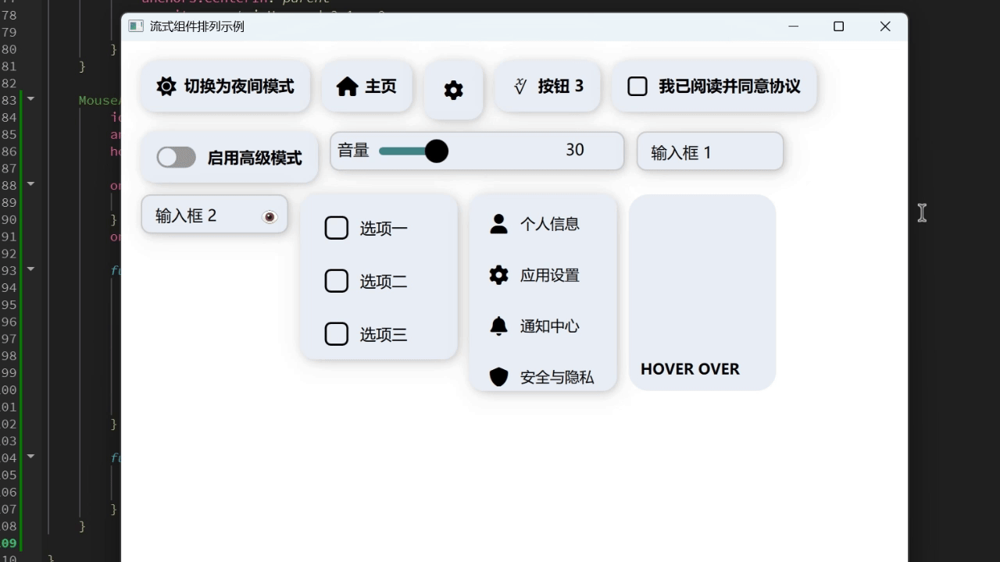

# EvolveUI - Modern QML 组件库



EvolveUI 是一个现代化、高度风格统一的 Qt6 QML 前端组件库，致力于为跨平台应用程序提供一致、优雅、响应式的 UI 体验。灵感来源于 Telegram 动效、Material Design 规范，并充分考虑了桌面与移动端的交互习惯。

---

## ✨ 项目亮点

- 🔧 **主题系统统一管理**：支持浅色 / 深色主题切换，颜色、阴影、边框统一由 `Theme.qml` 控制。  
- 🎨 **组件风格一致**：所有组件都遵循统一命名规范、圆角、阴影、多态配色、动态交互反馈。  
- ⚙️ **组件可复用性强**：每个组件都可独立使用，并支持灵活参数配置，轻松嵌入任意 QML 应用。  
- 🎯 **高质量动效支持**：广泛使用 `MultiEffect` 和 `SpringAnimation` 实现柔和动画，提升用户体验。  
- 📐 **响应式布局优化**：自动适配窗口尺寸，支持 `Layout` 自适应大小与间距，适用于多端设备。  

---

## 📦 已实现组件（完整）

| 组件名                | 描述                                   |
|-----------------------|----------------------------------------|
| `Accordion.qml`       | 下拉信息栏                              |
| `Avatar.qml`          | 头像组件                                |
| `BlurCard.qml`        | 高斯模糊卡片组件                        |
| `Button.qml`          | 带图标 + 动画的圆角按钮组件            |
| `Calendar.qml`        | 日历组件                                |
| `Card.qml`            | 基础卡片容器组件                        |
| `CardWithTextArea.qml`| 带文本区域的卡片容器组件                |
| `Carousel.qml`        | 轮播组件                                |
| `CheckBox.qml`        | 动画复选框组件                          |
| `Clock.qml`           | 时钟显示组件                            |
| `HoverCard.qml`       | 鼠标悬停浮起卡片容器组件                |
| `Input.qml`           | 支持焦点变色与阴影的输入框              |
| `List.qml`            | 列表展示组件                            |
| `NavBar.qml`          | 导航栏组件                              |
| `RadioButton.qml`     | 动画单选组件                            |
| `Slider.qml`          | 支持滑块动画的调节组件                  |
| `SwitchButton.qml`    | 动画开关组件                            |
| `Theme.qml`           | 全局样式与颜色定义                      |
| `TimeDisplay.qml`     | 时间显示组件                            |


## ♻️ 如何复用组件

1. **引入模块路径**（假设你把组件库放在 `components/` 文件夹）：

```qml
import "components" as Components
````

2. **使用组件**：

```qml
// 导入图标字体文件
FontLoader {
    id: iconFont
    source: "qrc:/new/prefix1/fonts/fontawesome-free-6.7.2-desktop/otfs/Font Awesome 6 Free-Solid-900.otf"
}

// 引入主题
Components.Theme {
    id: theme
}
```

```qml
Components.Button {
    text: "提交"
    iconCharacter: "\uf1d8"
    iconFontFamily: "Font Awesome 6 Free"
    onClicked: console.log("Clicked!")
}
```

3. **切换主题**（可绑定按钮或快捷键）：

```qml
Button {
    text: theme.isDark ? "切换到浅色" : "切换到深色"
    onClicked: theme.toggleTheme()
}
```

---

## 📌 依赖说明

* Qt 6.5 及以上版本（建议 6.6+）
* 使用 `MultiEffect`（推荐 QtGraphicalEffects 替代方案在 Qt6 中使用）
* 推荐使用 FontAwesome 字体图标（可自定义）

---

## 🧱 开发规范约定

* 统一以 PascalCase 命名组件文件（如 `HoverCard.qml`）
* 所有可配置属性必须暴露为 `property`，并配默认值
* 动效采用 `SpringAnimation` 或 `Behavior`，避免突变跳变
* 所有组件应使用 `theme` 中的配色与样式属性，避免硬编码颜色

---

## 📮 后续计划

* 支持组件懒加载与性能优化
* 提供完整的文档网站（使用 VitePress 或 MkDocs）
* 扩展更多容器类布局组件（如 GridCard、Toolbar、Tab 等）
* 实现设置面板与主题编辑器

---

## 📜 License

本项目遵循 MIT 协议，欢迎自由使用与二次开发。

---

欢迎 star 🌟、fork 🍴、提 issue 💬、提 PR 🔧！

## Star History

[](https://www.star-history.com/#sudoevolve/EvolveUI&Date)