# EvolveUI - Modern QML 组件库

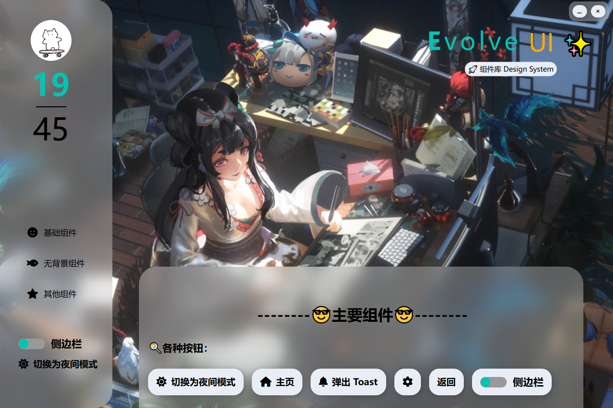

EvolveUI 是一个现代化、高度风格统一的 Qt6 QML 前端组件库，致力于为跨平台应用程序提供一致、优雅、响应式的 UI 体验。灵感来源于 Telegram 动效、Material Design 规范，并充分考虑了桌面与移动端的交互习惯。

---

## ✨ 项目亮点

- 🔧 **主题系统统一管理**：支持浅色 / 深色主题切换，颜色、阴影、边框统一由 `Theme.qml` 控制。  
- 🎨 **组件风格一致**：所有组件都遵循统一命名规范、圆角、阴影、多态配色、动态交互反馈。  
- ⚙️ **组件可复用性强**：每个组件都可独立使用，并支持灵活参数配置，轻松嵌入任意 QML 应用。  
- 🎯 **高质量动效支持**：广泛使用 `MultiEffect` 和 `SpringAnimation` 实现柔和动画，提升用户体验。  
- 📐 **响应式布局优化**：自动适配窗口尺寸，支持 `Layout` 自适应大小与间距，适用于多端设备。  

---

## 🖼️ 项目预览

以下是我们 EvolveUI 组件库的部分界面预览，展示了不同组件在实际应用中的效果：

<div align="center">
  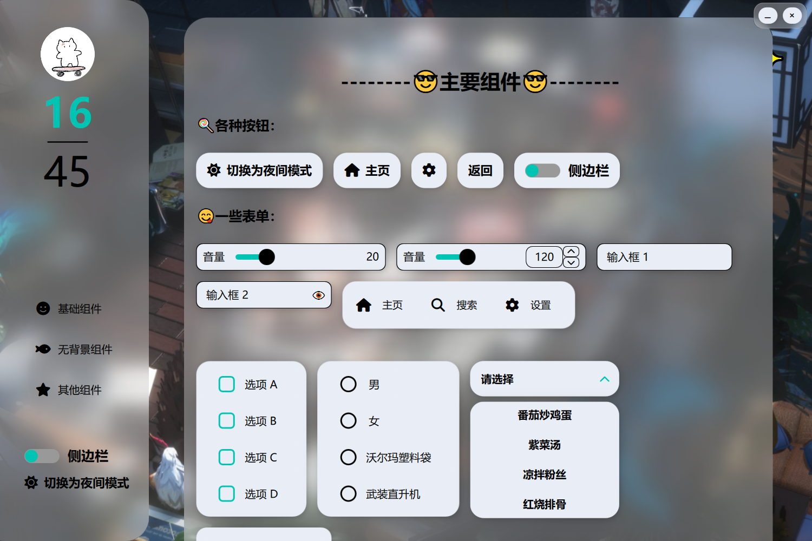
  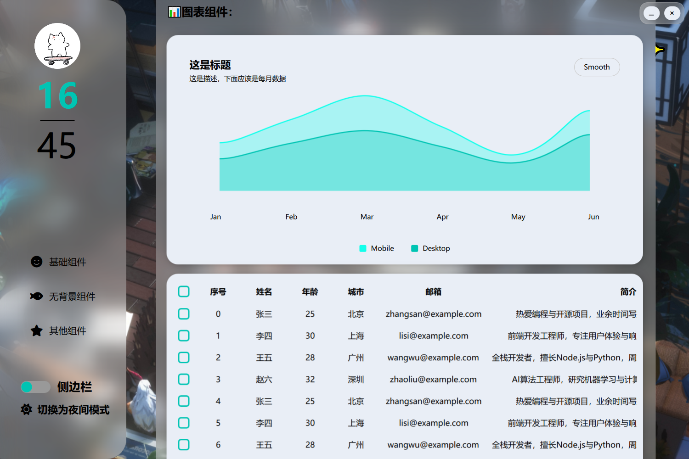 
  <br/><br/>
  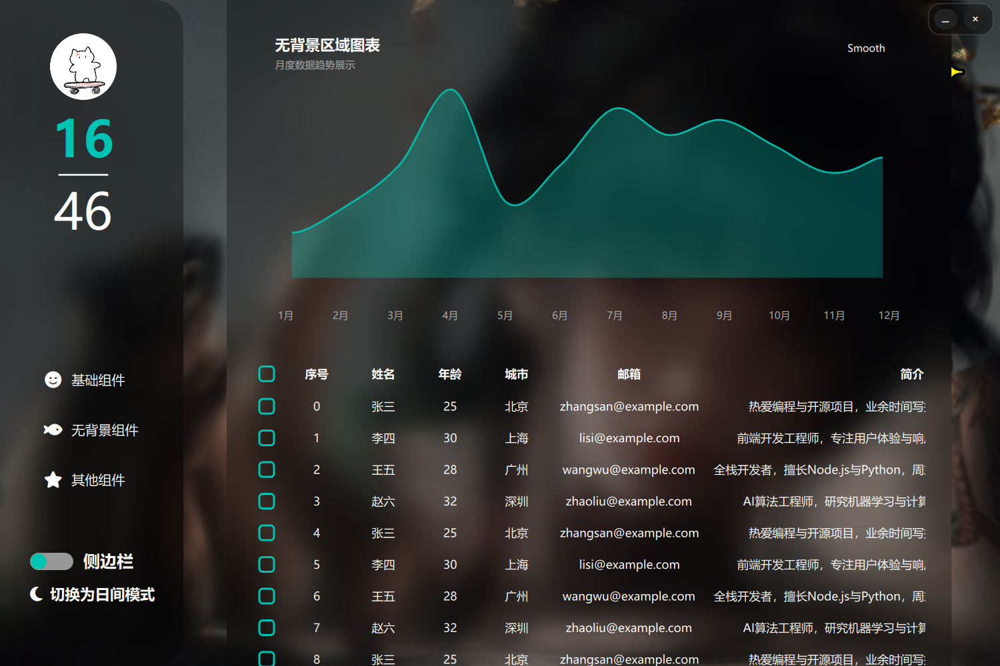
  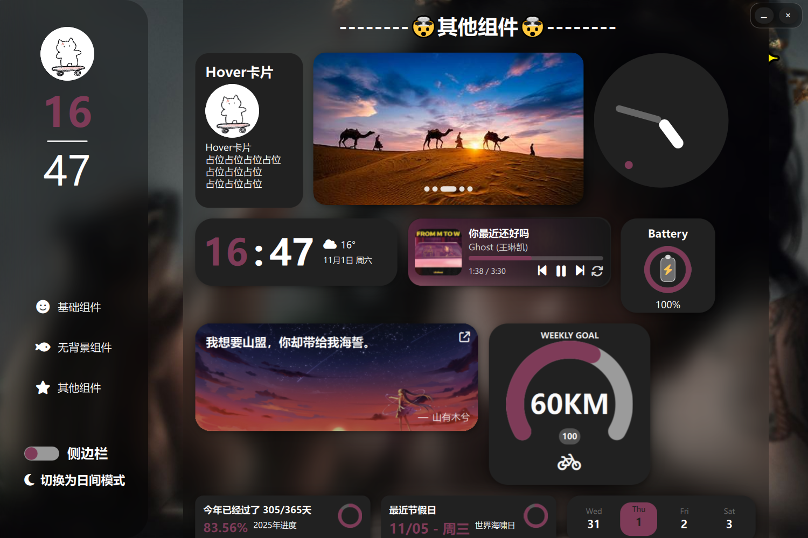
  <br/><br/>
  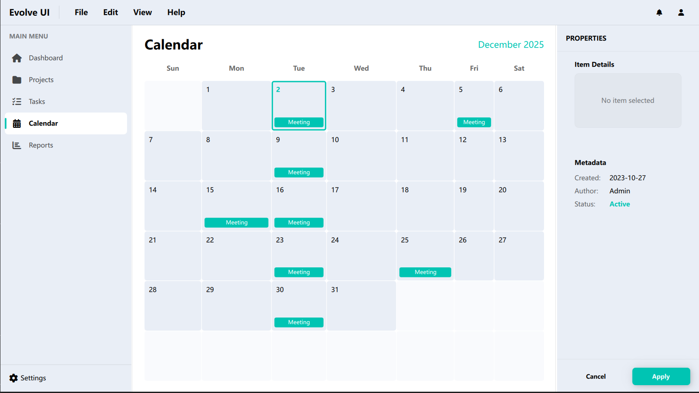
  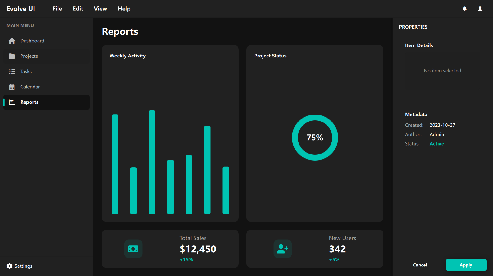
  <br/><br/>
  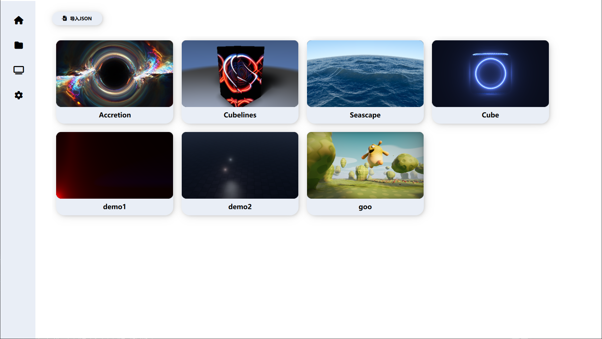
  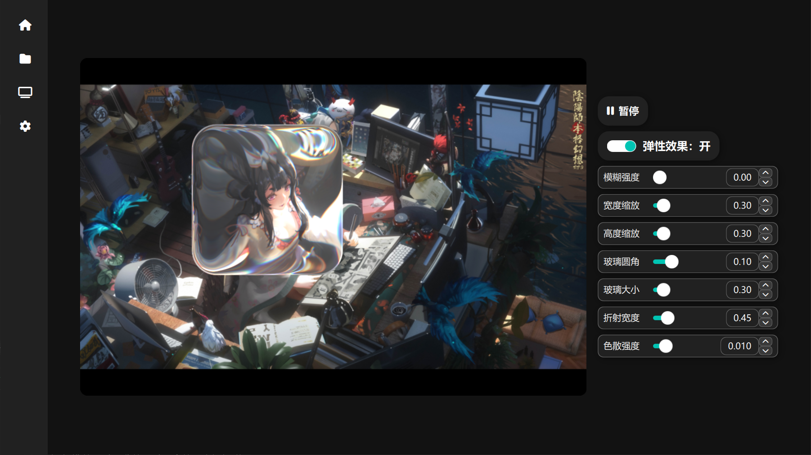
  <br/><br/>
  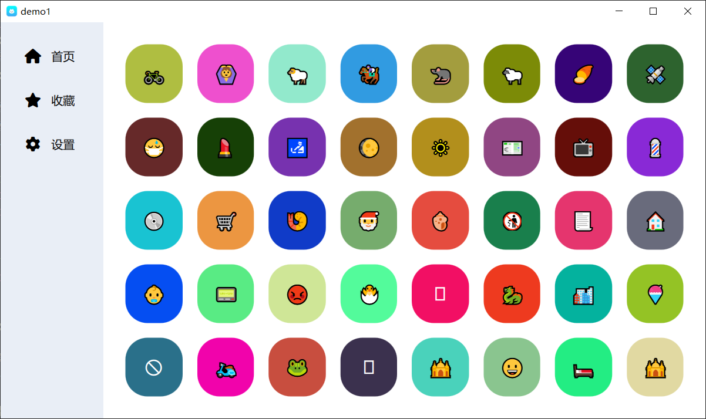
  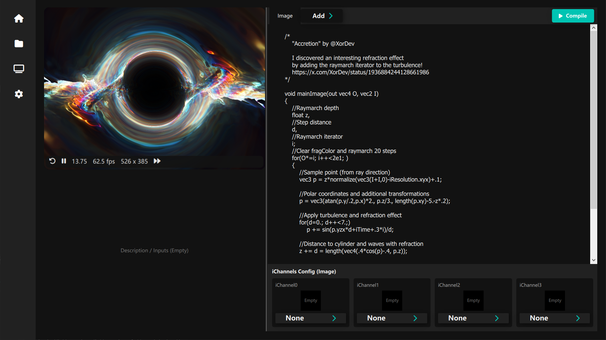
</div>

> 更多组件效果请查看 [视频演示](https://www.bilibili.com/video/BV1JQ1uBBEPy)

## 📦 已实现组件（完整）

| 组件名                | 描述                                   |
|-----------------------|----------------------------------------|
| `Aboutme.qml`          | 带有打字机效果的介绍界面                |
| `EAccordion.qml`       | 下拉信息栏                             |
| `EAnimatedWindow.qml`  | iPad os动画风格窗口组件                 |
| `EAvatar.qml`          | 头像组件                               |
| `EAreaChart.qml`       | 折线图组件                              |
| `EBatteryCard.qml`     | 电池状态卡片组件                        |
| `EBarChart.qml`        | 柱状图组件                              |
| `EBlurCard.qml`        | 高斯模糊卡片组件                        |
| `EButton.qml`          | 带图标 + 动画的圆角按钮组件              |
| `ECalendar.qml`        | 日历组件                                |
| `ECard.qml`            | 基础卡片容器组件                        |
| `ECardWithTextArea.qml`| 带文本区域的卡片容器组件                |
| `ECarousel.qml`        | 轮播组件                                |
| `ECheckBox.qml`        | 动画复选框组件                          |
| `EClock.qml`           | 时钟显示组件                            |
| `EClockCard.qml`       | 时钟卡片容器组件                        |
| `EDataTable.qml`       | 高性能表格组件                           |
| `EDrawer.qml`          | 侧边栏组件                              |
| `EDropdown.qml`        | 下拉选择框组件                           |
| `EFitnessProgress.qml` | 健身进度展示组件                        |
| `EHitokotoCard.qml`    | 一言卡片组件                            |
| `EHoverCard.qml`       | 鼠标悬停浮起卡片容器组件                |
| `EInput.qml`           | 支持焦点变色与阴影的输入框              |
| `EList.qml`            | 列表展示组件                            |
| `Eloader.qml`           | 加载动画组件                          |
| `EMenuButton.qml`     | 菜单按钮组件                          |
| `EMusicPlayer.qml`     | 音乐播放器组件                          |
| `ENavBar.qml`          | 导航栏组件                              |
| `ENextHolidayCountdown.qml` | 假期倒计时组件                   |
| `EPieChart.qml`       | 饼图组件                                |
| `ERadioButton.qml`     | 动画单选组件                            |
| `ESimpleDatePicker.qml`| 简易日期选择组件                        |
| `ESlider.qml`          | 支持滑块动画的调节组件                  |
| `EToast.qml`          | 支持消息提示的组件                      |
| `ESwitchButton.qml`    | 动画开关组件                            |
| `ETheme.qml`           | 全局样式与颜色定义                      |
| `ETimeDisplay.qml`     | 时间显示组件                            |
| `EYearProgress.qml`    | 年度进度展示组件                        |
| `EAlertDialog.qml`     | 弹窗组件                                |


## ♻️ 如何复用组件

1. **引入模块路径**（假设你把组件库放在 `components/` 文件夹）：

```qml
import "components" as Components
````

2. **使用组件**：

```qml
// 导入图标字体文件
FontLoader {
    id: iconFont
    source: "qrc:/new/prefix1/fonts/fontawesome-free-6.7.2-desktop/otfs/Font Awesome 6 Free-Solid-900.otf"
}

// 引入主题
Components.ETheme {
    id: theme
}
```

```qml
Components.EButton {
    text: "提交"
    iconCharacter: "\uf1d8"
    onClicked: console.log("Clicked!")
}
```

3. **切换主题**（可绑定按钮或快捷键）：

```qml
Button {
    text: theme.isDark ? "切换到浅色" : "切换到深色"
    onClicked: theme.toggleTheme()
}
```

---

## � 如何创建新项目

我们提供了一个便捷的脚手架脚本，可以帮助您快速创建一个包含 EvolveUI 基础框架的新项目。

1.  **找到脚本**

    进入项目根目录下的 `tools` 文件夹。

2.  **运行脚本**

    双击运行 `New-EvolveUIProject.bat` 文件。一个命令行窗口将会打开。

3.  **交互式输入**

    脚本会提示您输入以下信息：
    *   **Project Name**: 您新项目的名称 (例如: `MyApp`)。
    *   **Destination Directory**: 项目将被创建在哪个目录下 (默认为当前目录 `.` )。
    *   **Template Name**: 使用哪个模板 (默认为 `basic`)。

4.  **构建项目**

    脚本执行成功后，会输出用于构建项目的 `cmake` 命令，如下所示：

    ```bash
    # 进入项目目录
    cd path/to/your/new/project

    # 配置项目
    cmake -S . -B build

    # 编译项目
    cmake --build build
    ```

    按照以上命令操作，即可完成项目的编译和运行。

---

## 🚀 如何打包项目

当您成功编译项目后，可以使用我们提供的打包脚本，将您的应用程序打包成一个可以独立分发的绿色软件。

1.  **找到打包脚本**

    进入您创建的项目根目录，找到 `package.bat` 文件。

2.  **运行打包脚本**

    直接双击运行 `package.bat` 文件。

    > **注意**: 如果您是在 **PowerShell** 终端中运行，需要输入 `.\package.bat` 来执行。

    脚本会自动执行以下步骤：
    *   检查 `windeployqt` 工具是否存在。
    *   检查项目是否已成功编译。
    *   创建一个 `output` 文件夹。
    *   将 `.exe` 文件和所有依赖项（DLLs, QML 文件等）复制到 `output` 文件夹。

3.  **完成**

    脚本执行成功后，`output` 文件夹内的所有内容就是一个完整的、可独立运行的应用程序了。

---


## �📌 依赖说明

* Qt 6.5 及以上版本（建议 6.9+）
* 使用 `MultiEffect`（推荐 QtGraphicalEffects 替代方案在 Qt6 中使用）
* 推荐使用 FontAwesome 字体图标（可自定义）

---

## 🧱 开发规范约定

* 统一以 PascalCase 命名组件文件（如 `HoverCard.qml`）
* 所有可配置属性必须暴露为 `property`，并配默认值
* 动效采用 `SpringAnimation` 或 `Behavior`，避免突变跳变
* 所有组件应使用 `theme` 中的配色与样式属性，避免硬编码颜色

---

## 📮 后续计划

* 支持组件懒加载与性能优化
* 提供完整的文档网站（使用 VitePress 或 MkDocs）
* 扩展更多容器类布局组件（如 GridCard、Toolbar、Tab 等）
* 实现设置面板与主题编辑器

---

## 📜 License

本项目遵循 MIT 协议，欢迎自由使用与二次开发。

---

欢迎 star 🌟、fork 🍴、提 issue 💬、提 PR 🔧！

## Star History

[](https://www.star-history.com/#sudoevolve/EvolveUI&Date)
